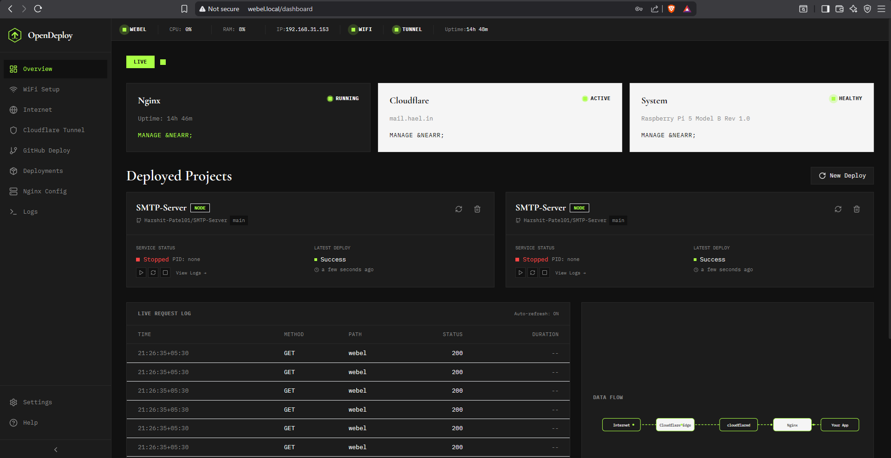
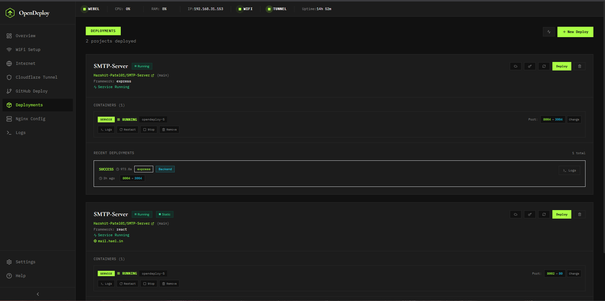
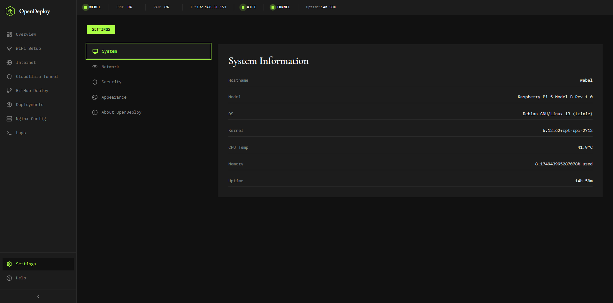
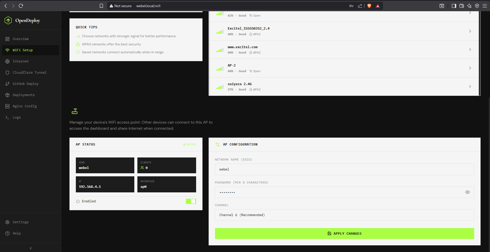

# OpenDeploy

OpenDeploy is a Next.js + Go dashboard that turns a Linux device (especially a Raspberry Pi) into a self-hosted platform-as-a-service (PaaS). Plug it in, open the dashboard, connect WiFi / Cloudflare Tunnel, and deploy apps from GitHub into LXD containers behind nginx.

Product name: **OpenDeploy**. The first-boot WiFi hotspot uses SSID **webel** and hostname **webel.local**.

## UI Screenshots

| | |
|:---:|:---:|
|  |  |
| **Dashboard** | **Deployments** |
|  |  |
| **Settings** | **WiFi Setup** |

---

## One-command install (Raspberry Pi / Debian / Ubuntu)

On a fresh Raspberry Pi OS or Ubuntu/Debian system (arm64, amd64, or armv7):

```bash
# From a cloned checkout that already has a built binary:
sudo ./scripts/install.sh --binary ./backend/opendeploy-linux-arm64

# Or build on the device (needs Go + Node):
sudo ./scripts/install.sh --from-source

# Or download a GitHub release asset (once releases are published):
sudo ./scripts/install.sh --repo Harshit-Patel01/WebEl
```

The installer will:

1. Detect OS and CPU architecture
2. Install apt packages (nginx, NetworkManager, hostapd, dnsmasq, Avahi, git, python3, iptables, …) and LXD
3. Run `lxd init --auto` when needed
4. Install the OpenDeploy binary, config, and systemd unit
5. Enable auto-start and print a dependency / system health checklist

After install:

- Dashboard: `http://<device-ip>:3000` or `http://webel.local:3000` (Avahi)
- Hotspot (when not on home WiFi): SSID `webel` / password `webel123`

### Supported host OS / packages

| Requirement | Notes |
|-------------|--------|
| OS | Raspberry Pi OS (Debian-based), Ubuntu, Debian — `apt-get` required |
| Arch | `arm64` (Pi 3/4/5 64-bit), `amd64`, `armv7` (32-bit Pi), `386` |
| nginx | Reverse proxy for deployed sites |
| NetworkManager + nmcli | Client WiFi |
| hostapd + dnsmasq | Captive / setup hotspot (`wlan0`) |
| avahi-daemon | `*.local` hostname resolution |
| LXD / LXC | App containers (snap or apt) |
| git, python3 | Host tooling; Node/npm recommended |
| cloudflared | Auto-downloaded for the **running** arch when you set up a tunnel |
| iptables / iptables-persistent | Hotspot NAT |

OpenDeploy runs as **root** via systemd so it can manage WiFi, nginx, and LXD.

---

## Development

### Frontend

```bash
cd frontend
npm install   # or npm ci when package-lock.json is present
npm run dev
```

### Backend

```bash
cd backend
go run ./cmd/opendeploy --config config.example.yaml
```

---

## Building a release binary

The frontend is a static Next.js export. [`frontend/next.config.js`](frontend/next.config.js) sets `distDir` to `../backend/static/frontend`, so `npm run build` writes files that Go embeds via `go:embed` — **no manual `cp` step**.

```bash
# From repo root — Makefile handles frontend export + arm64 binary:
make -C backend build-release

# Or manually:
cd frontend && npm install && npm run build
cd ../backend
# Windows PowerShell:
$env:GOOS="linux"; $env:GOARCH="arm64"; go build -o opendeploy-linux-arm64 ./cmd/opendeploy
# Unix:
env GOOS=linux GOARCH=arm64 go build -o opendeploy-linux-arm64 ./cmd/opendeploy
```

Other targets: `make -C backend build-linux-amd64`, `build-linux-arm`, `build-linux-386`, or `build-all`.

---

## Manual install (without the bootstrap script)

If dependencies are already installed:

```bash
# On the Pi, with the matching binary present:
sudo make -C backend install
sudo systemctl start opendeploy
```

`make install` selects the binary for the host arch, installs `/etc/opendeploy/config.yaml` from [`backend/config.example.yaml`](backend/config.example.yaml), enables the systemd unit, and keeps data dirs root-owned (matching `User=root` in [`backend/opendeploy.service`](backend/opendeploy.service)).

Or copy files by hand:

```bash
sudo install -m 755 opendeploy-linux-arm64 /usr/local/bin/opendeploy
sudo mkdir -p /etc/opendeploy /var/lib/opendeploy /var/log/opendeploy
sudo cp backend/config.example.yaml /etc/opendeploy/config.yaml
sudo cp backend/opendeploy.service /etc/systemd/system/opendeploy.service
sudo systemctl daemon-reload
sudo systemctl enable --now opendeploy
```

---

## WiFi Hotspot Feature

OpenDeploy can create a WiFi hotspot when the device is not connected to a network so you can reach the dashboard.

### Hotspot Details

- **SSID:** `webel`
- **Password:** `webel123`
- **Dashboard URL:** `http://webel.local:3000`
